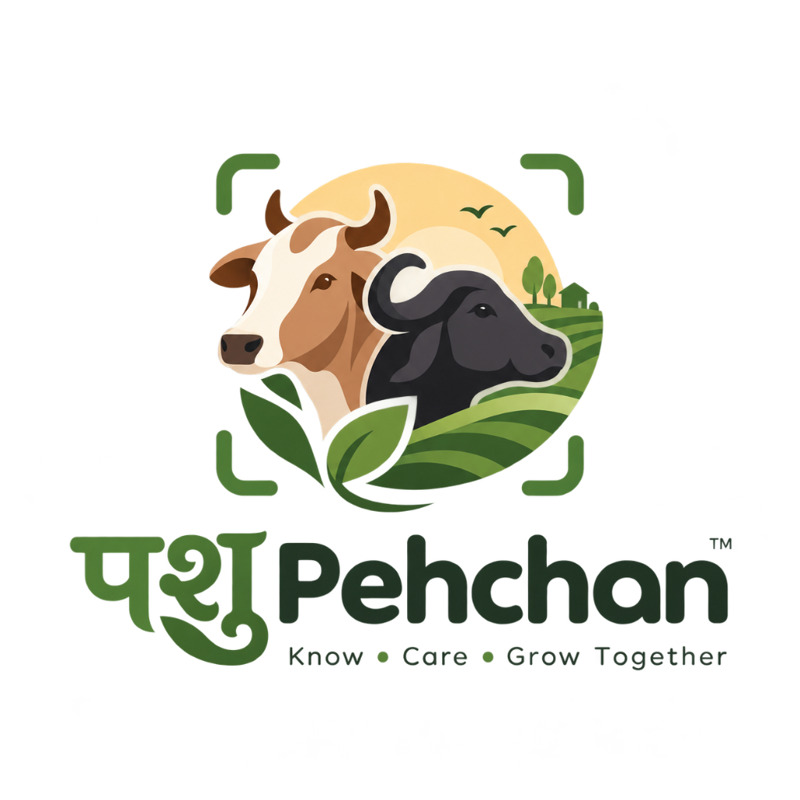

<div align="center">
  
  <h1>PashuPehchan</h1>
  <p><strong>PS-5: AI-Driven Cattle & Buffalo Breed Identification</strong></p>
  <p><em>"Know • Care • Grow Together"</em></p>
</div>

> **"AI suggests. Human verifies. System records."**  
> An enterprise-grade, cross-platform livestock intelligence platform built for India's National Livestock Mission and Bharat Pashudhan data integrity.

---

## 🌟 Key Features

1. **Indigenous Bovine Vision Model**:
   - Classifies **41 ICAR-NBAGR recognized breeds** of indigenous cattle and buffalo.
   - Preserves custom trained **PyTorch `EfficientNet-B0`** weights (`server/models/best_model.pth`).
   - Ultra-fast CPU latency (~30-45ms) and calibrated confidence tiers (`HIGH`, `MEDIUM`, `LOW`).
   - Strict adherence to hackathon constraints: **Zero reliance on Gemini or multimodal LLMs** for vision classification.

2. **Role-Based Experiences & 1-Click Persona Switcher**:
   - **Farmer Portal (🌾 Ramesh Patel)**:
     - Digital herd records with tag numbers, lactation stages, and daily milk yield tracking.
     - 1-click marketplace listing of verified livestock with custom asking prices.
     - Buyer enquiry management with direct offer review and 1-tap phone calls.
   - **Middleman / Trader Portal (🤝 Kishore Bhai)**:
     - Procurement hub with verified breed filters (Gir, Murrah, Kankrej, Sahiwal, Jaffarabadi).
     - **Multi-Bovine Spec Comparison Tool**: Side-by-side spec table evaluating price, milk yield, AI breed confidence, age, and location.
     - Watchlist bookmarking with personal notes and direct seller contact.
     - Direct offer submission with custom negotiation amounts.
   - **Supervisor / Admin Portal (🛡️ System Supervisor)**:
     - Real-time platform governance: registration counts, verification ratios, marketplace volume, and model inference telemetry.

3. **Veterinary Care & Emergency Discovery**:
   - Locates government veterinary polyclinics, Amul cooperative diagnostic centres, and mobile field units.
   - Real-time GPS distance calculation and category filtering.
   - **One-tap [Call Clinic]** and **[Directions]** launching Google Maps.
   - **24x7 Emergency Helpline Banner** with instant 1-click dial to Govt toll-free **1962**.

4. **Cross-Platform Architecture (Web & Mobile)**:
   - Built on **React Native Web**, running smoothly in browsers and compiling to Android via Expo / EAS.
   - Modular platform adapters (`Camera`, `Location`, `MapDirections`, `Call`, `Storage`) prevent cross-platform crashes.
   - **Deployable to Vercel** (`frontend/vercel.json`) and **EAS Android APK** (`frontend/app.json`, `frontend/eas.json`).

---

## 🔑 Demo Personas & Credentials

The application includes a **1-click Role Switcher** in the top-right header for hackathon judges:

| Role | Name | Email | Password | Pre-seeded Data |
| :--- | :--- | :--- | :--- | :--- |
| **Farmer** | Ramesh Patel | `ramesh@example.com` | `Farmer@123` | 4 Verified Cattle (Gir, Murrah, Sahiwal, Jaffarabadi), Active Listings, 2 Enquiries |
| **Middleman** | Kishore Bhai | `kishore@example.com` | `Middleman@123` | Active Marketplace, 3 Bookmarked Watchlist Cattle, Sent Offers |
| **Admin** | Supervisor | `admin@example.com` | `Admin@123` | System telemetry, verification rates, model inference latency metrics |

---

## 🚀 Quickstart Guide

### Prerequisites
- Python 3.10+
- Node.js 18+ and npm

### 1. Start Shared Backend (FastAPI)
```powershell
# In project root
.\.venv\Scripts\python.exe -m uvicorn server.app.main:app --host 127.0.0.1 --port 8000 --reload
```
- API Docs: `http://127.0.0.1:8000/docs`
- Health check: `http://127.0.0.1:8000/api/health`

### 2. Start Frontend Application (React Native Web)
```powershell
cd frontend
npm.cmd run dev
```
- Open browser at `http://localhost:3000`

---

## 🧪 Testing & Verification

### Run Backend Integration Tests
```powershell
.\.venv\Scripts\python.exe -m pytest server/tests/test_platform.py -v
```
*All 12 tests pass (Auth, RBAC, Animals, Marketplace, Watchlist, Enquiries, Vets, Telemetry).*

### Run Production Build Test
```powershell
cd frontend
npm.cmd run build
```
*Vite compiles 2100+ modules into production assets in `dist/` with 0 errors.*

---

## 📦 Deployment

### Deploy Web App to Vercel
1. Set output directory to `frontend/dist`.
2. Ensure `frontend/vercel.json` is in the frontend root.
3. Configure environment variable: `VITE_API_URL=https://your-backend-api.com`.

### Build Android APK via EAS
```powershell
cd frontend
npx.cmd eas-cli build -p android --profile preview
```
*Directly downloads a standalone `.apk` installable on any Android device.*
